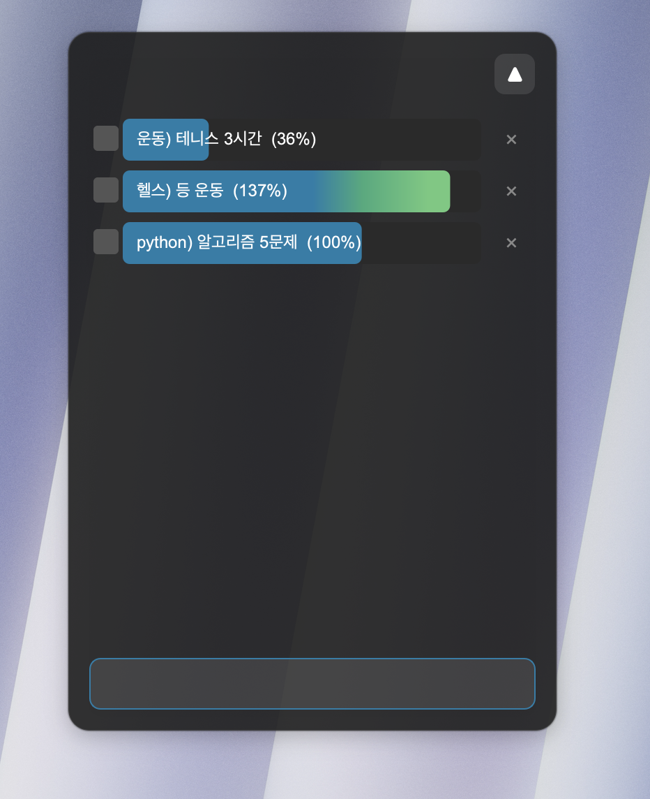
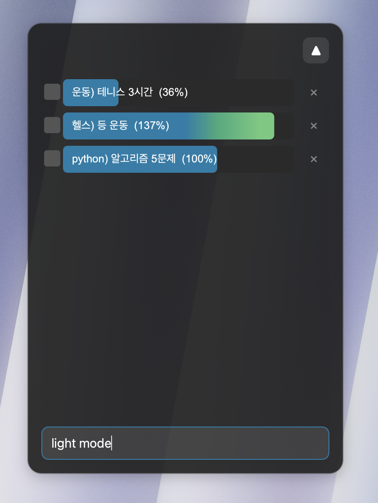
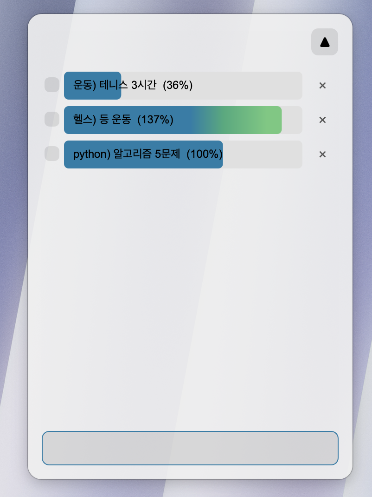
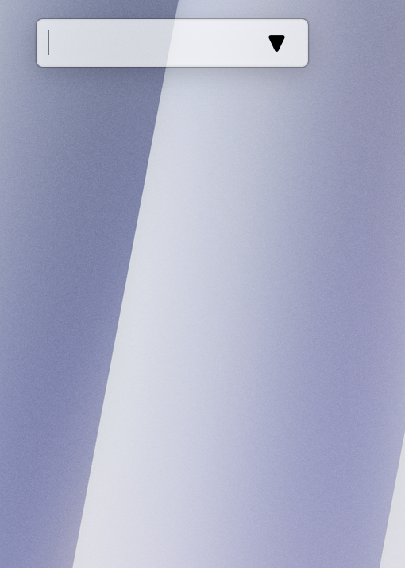

# Mac Todo Progress Widget

추후 내 하루 일과 보여주는 시간표? 위젯과 연결할 예정  
명령어 계속 추가할 예정

---

## 🇰🇷 한국어

macOS용 미니멀 데스크톱 **Todo Progress 위젯**입니다.  
PyQt6 + SQLite3 기반으로 구현되었으며, 키보드 명령어만으로 대부분의 기능을 사용할 수 있습니다.

### 주요 기능

| 기능 | 설명 |
| :--- | :--- |
| Frameless & 투명 UI | 타이틀바 없이 배경과 자연스럽게 어우러지는 글래스모피즘 스타일 |
| 프로그레스 바 | 각 항목 내부를 좌·우로 드래그하여 0 ~ 150% 진행률 설정 |
| 자동 저장 (SQLite) | 앱 종료 후에도 데이터 유지, 소프트 삭제 방식 지원 |
| Drag & Drop | 항목을 드래그해 순서 변경 및 DB 자동 업데이트 |
| 최소화 모드 | ▲/▼ 토글로 한 줄짜리 슬림 바로 즉시 축소 |


### 명령어 가이드

입력칸에 아래 명령어를 입력하고 `Enter`를 눌러 실행합니다.

| 명령어 | 기능 |
| :--- | :--- |
| `태그) 내용` | **할 일 추가** — `)` 앞 단어가 Tag로 기록되어 DB 정제에 활용됩니다. |
| `light mode` | 라이트 테마로 전환 |
| `dark mode` | 다크 테마로 전환 |
| `block` | 드래그 그립 모드 진입 (창 이동용). 해제는 **더블 클릭** |
| `exit` | 위젯 종료 |

---

### 스크린샷

**태그) 내용 형식으로 할 일 추가 (다크 모드)**



> `운동) 테니스 3시간`, `헬스) 등 운동`, `python) 알고리즘 5문제` 형식으로 입력.  
> `)` 이전 단어가 카테고리 Tag로 DB에 저장되어 향후 분석에 활용됩니다.  
> 진행률 바를 좌·우로 드래그하여 0 ~ 150% 설정 가능. 100% 초과 시 그라데이션으로 구분됩니다.

---

**`light mode` 명령어 입력 → 라이트 테마 전환**

| 입력 전 (다크, 명령 입력 중) | 전환 후 (라이트 모드) |
|:---:|:---:|
|  |  |

---

**최소화 모드 — 단 한 줄로 압축**



> ▼ 버튼 클릭 시 리스트가 사라지고 입력창 + 아이콘만 남습니다.  
> 여백 없이 콘텐츠 크기에 딱 맞게 축소됩니다.

---

### 태그(`)`앞 단어) 활용 예시

```
운동) 헬스 - 1시간
공부) python 알고리즘 문제 풀기
project) 알람 기능 생성
```

> `)` 이전 단어를 카테고리 Tag로 사용함으로써,  
> 나중에 데이터베이스에서 태그별 필터링·분석이 용이하도록 설계되었습니다.


### 설치 및 실행

**1. 의존성 설치**

```bash
pip install -r requirements.txt
```

**2. 최초 실행** — 프로젝트 폴더에서 한 번만 실행하면 됩니다.

```bash
cd /path/to/mac_todo_widget
./todo
```

> 최초 실행 시 `~/.zshrc`에 alias가 **자동으로 등록**됩니다.  
> 이후 터미널에서는 아래 한 줄로 실행할 수 있습니다.

```bash
source ~/.zshrc   # 현재 탭에 설정 즉시 적용 (최초 1회)
todo              # 이후 어디서든 실행
```

---

## 🇬🇧 English

A minimalist desktop **Todo Progress Widget** for macOS.  
Built with PyQt6 and SQLite3, controlled entirely via keyboard commands.

### Features

| Feature | Description |
| :--- | :--- |
| Frameless & Transparent UI | Glassmorphism style that blends into the desktop without a title bar |
| Interactive Progress Bar | Click and drag left/right on any task to set progress from 0% to 150% |
| Auto-save (SQLite) | Data persists after closing; soft-delete is supported |
| Drag & Drop Reordering | Drag items to reorder; display order is saved to the DB automatically |
| Collapse Mode | Toggle ▲/▼ to instantly shrink the widget to a single slim bar |


### Command Guide

Type a command into the input field and press `Enter`.

| Command | Action |
| :--- | :--- |
| `tag) content` | **Add a task** — the word before `)` is stored as a Tag for DB filtering |
| `light mode` | Switch to light theme |
| `dark mode` | Switch to dark theme |
| `block` | Enter drag-grip mode (to reposition the window). **Double-click** to exit |
| `exit` | Quit the widget |

---

### Screenshots

**Tag-based task entry (Dark Mode)**


> Tasks like `운동) 테니스 3시간`, `헬스) 등 운동`, `python) 알고리즘 5문제`.  
> The word before `)` is saved as a category Tag in the DB for later analysis.  
> Drag the progress bar left/right to set 0–150%. Over 100% shows a gradient transition.

---

**`light mode` command → Light theme switch**

| Before (Dark, command typed) | After (Light Mode applied) |
|:---:|:---:|
|  |  |

---

**Minimized Mode — Collapsed to a single bar**


> Click ▼ to hide the list, leaving only the input field and icon.  
> The widget snaps to fit-content height with zero wasted space.

---

### Tag (`)` prefix) examples

```
Workout) Gym - 1 hour
Study) Solve python algorithm problems
Project) Build alarm feature
```

> The word before `)` acts as a category **Tag**.  
> This makes it easy to filter and analyse tasks by category directly from the database.


### Installation & Running

**1. Install dependencies**

```bash
pip install -r requirements.txt
```

**2. First run** — run once from the project folder.

```bash
cd /path/to/mac_todo_widget
./todo
```

> On the **first run**, the alias `todo` is **automatically registered** to `~/.zshrc`.  
> After that, you can launch the widget from anywhere:

```bash
source ~/.zshrc   # apply settings to current terminal tab (one-time only)
todo              # run from anywhere afterward
```